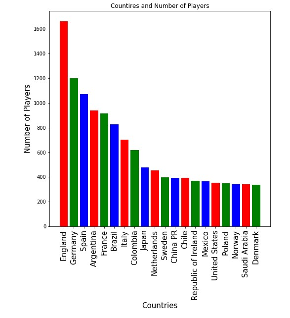
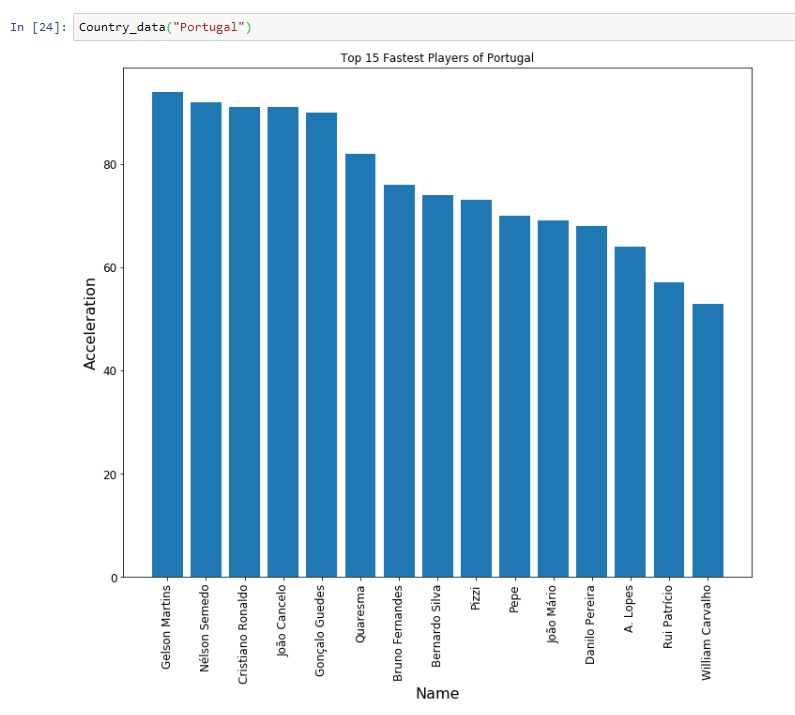

# **FIFA - Fun Illustrations For your Amazement**
## **Aakash Dogra**

“*Visualization is really about external cognition, that is, how resources outside the mind can be used to boost the cognitive capabilities of the mind.*”

**— Stuart Card**

#### The quote truly shows what a visualization can do to an individual’s sense of understanding of a subject. This article does not signify the importance of visualization, but it’s an attempt to convey my story of how I worked my way through a data set and tried to visualize my idea of how I see the data.

#### Before we set out to the see the different visualizations and illustrations of the data, we will understand the importance of visualization. It is often regarded as a skill that is taught to every entry-level data enthusiast, but in reality, it is something that is mastered only by a few! Data visualization, in general, is a pictorial or visual representation of data for making the number visually appealing. Or if we have to say this in the simplest manner, it is like giving kids a book with pictures to catch their attention!

#### In this article, I have tried to portray my skills with data manipulation, analysing, cleaning and visualization with something I love the most: Football. To my readers in the United States, Football here refers to the actual game where the ball is kicked by foot, hence the name football. This dataset is actual ratings and stats of players all around the world who are involved in the digital game of FIFA, developed by EA. This game is played by millions all around the world and is something enjoyed by every gamer around the globe. I will try to visualize the stats that we generally see during the post-game talk, like the best players around the world, in terms of their attributes and value. Also, I would provide some suggestions, based on my analysis of the dataset. I hope you enjoy this visual journey and learn a few things on the way!

#### The dataset is originally scrapped from https://sofifa.com/, as scraping data from official FIFA website is not permitted. The data set consists of data of all the players around the world, their personal stats and their career information. The data is read using pandas library. The dataset looks like follows:

#### The initial analysis of the dataset gives us varied information, including the different columns in the dataset, what kind of attributes are included, etc. In addition to this, it also gives us information about the data type of different columns. For example, 

#### Focussing on how to envisage the data, we need to make some changes in the dataset to make the data more visualization friendly. Further analysis of the dataset shows us where the data is still ‘unclear’ or the data needs to be formatted according to the visualization needs. At this stage, I generally either drop the column or format it into the best possible type. In this case, I dropped a couple of columns as they were unnecessary for my calculations or analysis. Furthermore, I formatted the Wages and Value columns from Object datatypes to float datatype. This was done to have float or numerical data for better visualization. 

#### After doing this, I start with my first visualization. This visual gives us information about the total number of players in countries around the world. To make the visualization more understandable, we take only the top 15 countries, in descending order, to depict the number of players in that country. This plot is called the bar plot and is plotted using matplotlib library.

#### As we can see, the visual above shows that England has the maximum number of football players in the world, followed by Germany, Spain and Argentina. This visual gives us the general idea about which country has maximum number of the football players in the world.

#### After the first visualization, we see that the data can be illustrated on a world map using certain parameters. Thus, next we try to visualize this data on a world map. This is done using plotly’s choropleth, which visualizes the ‘Number of players in a country’ on the world map.

#### As seen, while hovering over the map, one can see the total number of players in a country, here, Brazil.
This visual helps us to know about the number of players around the globe, with a heatmap legend on the right, giving the count information.

#### Now, I will try to create an interactive graphical interface, where while clicking on the country of your choice, another visualization opens, which gives the details of 20 players with the best Overall rating and least Overall rating. This interactive graph is as follows:

#### The above interactive graph is created for every country in the world and gives us the information of the players with best rating and players with least rating, considering only the overall rating of the players.

#### To further the investigation on the data, I tried to plot player attributes of players for a country. Attributes like Sprint Speed, Acceleration, Dribbling, etc.

#### The first attempt at this was plotting a bar graph of the players versus Sprint speed. This graph was created to understand how the data varies for different countries, in this case, Portugal.

#### As seen, the sprint speed of top 15 players in Portugal are nearly same and above an average of 83. Since the data can be created for Sprint Speed, the same can be done using other parameters too. Thus, to do this, I created widgets using ipywidgets library in Python.

#### The Dropdown widgets are created to for x-axis, y-axis and country name to give the user the freedom to choose from different parameters, making the graph more interactive and interesting. But after analysing the data more, I found out that the x-axis has to be kept constant with the value of ‘Name’ of players in order to achieve the same results as done in previous graph. The following graph depicts the interactive version using `plotly`: 

#### The above interactive graph gives us details of top 15 players in every country with highest attribute value.
 
#### The next interactive graph gives detailed information about personal attributes of players like Crossing, Finishing, Curve, Dribling, etc.

#### The motive behind executing these visualizations- to give an insight into data science and how different sectors’ information of our day to day life can be used to make unstructured data into beautiful illustrations. I believe that many more visualizations can be created using other libraries like dash, seaborn to create intearctive visuals that can help to undestand the data in a better way. I believe these visuals help you to understand the data in a better way and inspire you to perform exploratory analysis on any data you choose henceforth.
